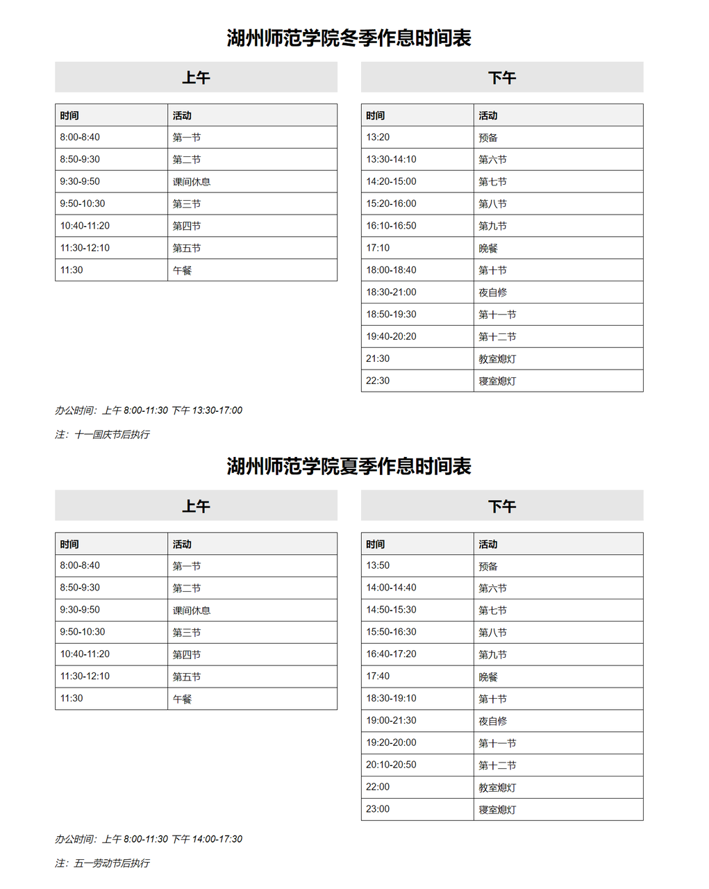
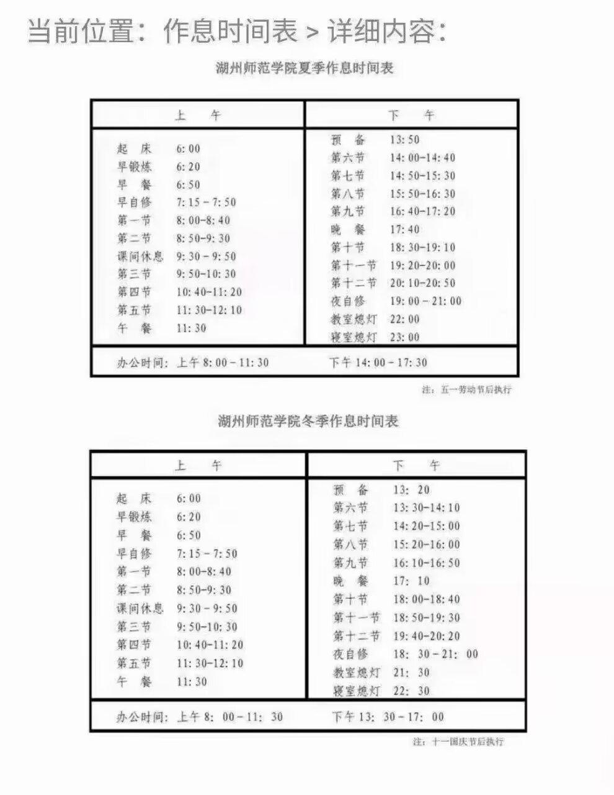
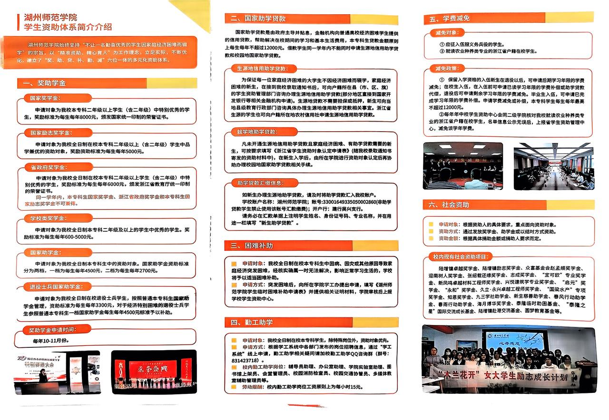

# College-Knowledge

团队进度跟进，时间线，发什么？：

贾-3月6日：目前我们团队前景大好，但是有一丝迷茫的感觉（今天那个“湖院小布丁” 给我一些慌张，从中得到一些启发） 这里首先总结一下时间线
研究生：
  3.30-3.31: 第一志愿复试 ； 
  3.28:开通“网上调剂意向采集系统；
  4.1:会得到一个调剂大体情况，随后按调剂政策确定复试考生并发放复试通知。 ；
  4.8:开通“调剂服务系统；
  4.29:出研究生拟录取名单公示（会一直公示到5月14日）！这个时间就是最火的时候！录取的人是一批大流量要开始强劲引流+之前预约的回访情况（肯定有考上的，可以直接开始办卡，）https://yjsy.zjhu.edu.cn/2024/0429/c1783a215314/page.htm
  7.15:发送录取通知书（https://mp.weixin.qq.com/s/mYWlbfyawXpCuU6DpqYm2Q）链接里面有图片，到时候可以直接用来发（也是一波好流量+加上宣传学校）所以提前搞两个账号很有必要，因为7月20多号会有高考出录取，最火热的时候流量不能乱！
  9.8：研究生报道（https://mp.weixin.qq.com/s/PcBJXLlu7iFqX7FnMRbCYw）坚定理想信念，一定有没办的，我们可以拿下！
  
三位一体：
  3.2-3.13:线上报名
  3.15-3.20:上传材料
  3.28：湖州师范学院本科招生网上公布入围综合素质测试考生名单
  3.31-4.3: 线上缴费
  4.8:完成缴费的考生可登录湖州师范学院本科招生网右下方“报名系统”，打印准考证。
  4.12: 综合素质测试 （形式：面试）
  4.22:考生可通过湖州师范学院本科招生网右下方“报名系统”查询成绩。
          综合素质测试合格考生名单将在学校本科招生网上进行公示

专升本： 
3.15-3.19：网上报名
3.23: 审核报名 查询报名审核结果
3.24-3.25:网上缴费
4.19（周六）：升本考试
5月中旬：考试院公布成绩 进行投档
7.15: 完成专科毕业资格审核确认；招生高校通过名单办理录取手续，寄发录取通知书；（这段时间5月中旬公布成绩以后就是大干的时间！我们要介绍学校然后 让他们注销原本校园卡 然后线上办我们的）
9月：开学报道

高考：（我详细地列了具体录取时间，但是大家不要被这个时间限制住， 这些时间只是给我们提供了一个更加详细的指导，可以让我们想出新的策略，我们对手过去动态和目前形势要研究出来最佳流量获取形式； 具体打法和详细我们要详细沟通，然后从各省的实际获取信息的时间与我校完成对该省的录取工作时间进行比对，到时候作品来引流肯定是每天漫天飞舞，如何精准并有效获取就是我们的前期养号和流量获取形式所决定的了！！！
6.7: 高考
6.29-8.5: 投档时间段（大部分投档时间集中在7月中旬，例如湖南7.21-7.22）这个时候是最火爆的时候，专心致志做高考准备迎接流量到来）！！！！（各地投档时间：https://mp.weixin.qq.com/s/fXqzKFq8bhwPYFdmUuY5rg）
7.12:湖州师范学院完成了提前批录取（24年录取了271个人，三位一体占大多数）（湖师新生QQ群号：https://mp.weixin.qq.com/s/b1_lRYx49FKa03LHqUuhGw）
7.18:湖州学院完成2024年江苏普通类录取工作
7.19:湖州学院完成2024年上海&山东普通类录取工作
7.21:湖州学院完成浙江普通类录取工作（流量之巅：https://mp.weixin.qq.com/s/GJFtc55ywStopcmy3adfbg）这个链接里面有湖州学院新生QQ群号；
7.21:湖州师范学院完成浙江普通类一段、内蒙古一本、广东普通类、北京普通类、吉林普通类、吉林预科、上海普通类，并发布录取情况（https://mp.weixin.qq.com/s/8O9VEjeXrCBKJwzbx6ZiGQ）
7.23:湖州学院完成2024年湖南&重庆普通类录取工作
7.24:湖州学院完成2024年河北&广西普通类录取工作。    湖州师范学院浙江省普通类一段等1552份录取通知书已发出
7.25:湖州学院完成2024年江西&贵州普通类录取工作
7.27:湖州学院完成2024年湖北普通类录取工作
7.28:湖州学院完成2024年黑龙江普通类录取工作
7.29:湖州学院完成2024年福建&内蒙古普通类录取工作
7.30:湖州学院完成2024年安徽普通类录取工作
7.31:湖州学院完成2024年河南普通类录取工作
8.2:湖州学院完成2024年四川普通类录取工作
8.5:湖州学院完成2024年云南普通类录取工作
8.8:湖州学院完成2024年山西普通类录取工作

考研
时间节点：
复试：3.30-3.31 “网上调剂意向采集系统”将于3月28日开通 ;调剂服务系统”将于4月8日开通

Deepresesrch
1. 湖州师范学院研究生招生概况与专业方向
湖州师范学院目前招收多学科领域的硕士研究生，涵盖教育学、理学、工学、医学、经济管理等多个学院和专业。2024年学校实际录取硕士研究生**891人**，2025年的招生规模预计与上年相近（最终计划以教育部下达为准） dxsbb.com 。学院下设学术型硕士和专业型硕士两大类培养项目，包括：  

- 学术学位硕士：如教育学原理、数学等学科的学术型硕士研究生。  
- 专业学位硕士：涵盖教育硕士（学科教学、小学教育、心理健康教育等多个方向）、工程硕士（控制工程、机械工程、材料与化工等）、临床医学硕士（内科学、儿科学、外科学等多个专科方向），以及其他专业硕士如国际商务、旅游管理、农业（农村发展、渔业发展）等 m.yanxian.org  m.yanxian.org 。各专业一般按所在二级学院招生，例如经济管理学院招收国际商务、旅游管理等专业，教师教育学院招收教育硕士各领域，理学院和工学院招收理工类硕士，医学院·护理学院招收临床医学和护理等专业。每个专业通常设置若干**研究方向**供考生选择（如计算机科学与技术专业下设“智能信息处理”“机器视觉与智能系统”等研究方向） m.yanxian.org 。专业目录中公布了各专业拟招人数及考试科目 dxsbb.com  dxsbb.com 。  

2. “三位一体”综合评价招生模式解读
适用范围：湖州师范学院是浙江省内开展“三位一体”综合评价招生的高校之一 gaokao.eol.cn 。这一招生模式针对浙江省高考考生，以高考成绩、高中学业水平考试成绩和学校综合测试成绩“三位一体”进行评价录取。目前该模式仅在浙江试点，本校2024年通过“三位一体”招收**235名**本科新生 gaokao.eol.cn （2025年名额以当年公布为准）。考生须为已报名参加浙江省普通高考的考生。  

报名条件：报考学生的高中综合素质评价需达到B等及以上，同时需满足学业水平考试成绩要求 gaokao.eol.cn 。湖州师范学院根据报考专业的性质分为师范类和非师范类提出不同要求：师范类专业要求学考科目A等和B等累计**7门及以上**（其中小学教育等部分专业要求至少2门A等，其余师范专业至少1门A等），其余科目不低于D等；非师范类专业要求A+B累计**5门及以上**，其余不低于D等 gaokao.eol.cn 。往届生学考等第按新高考改革对应等第认可。  

选拔方式：符合条件的考生需在每年3月上旬通过学校本科招生网提交个人申请和材料 gaokao.eol.cn  gaokao.eol.cn 。学校将按以下程序遴选：首先，高中学业水平成绩特别优秀的考生可**直接获得综合素质测试资格**（如学考A等达到规定数量） gaokao.eol.cn 。若直接入围人数未达到计划数的一定比例（如8倍），则由学校组织专家对其余考生的学业成绩和申请材料进行书面评审，择优确定补充进入校测的名单 gaokao.eol.cn 。入围考生参加学校组织的**综合素质测试**，形式包括笔试、面试等，重点考察专业潜质和综合能力。  

录取办法：校测后，学校将在高考成绩公布后将**高考成绩、校测成绩、高中学业成绩**按比例合成考生的综合成绩。其中，高中学业水平考试成绩折算成百分制后占比20%，学校综合测试成绩占比20%，高考总分（折算成百分制）占比60% gaokao.eol.cn 。具体折算方法为：综合成绩 = 学业水平成绩（满分100）×20% + 综合测试成绩×20% + 高考成绩（折合100）×60% gaokao.eol.cn 。依据考生综合成绩从高到低排序录取，各专业按计划数划定校内投档线录取 gaokao.eol.cn 。当综合成绩相同时，依次比较高考总分、综合测试成绩、学业水平成绩等单项，直至区分排序 gaokao.eol.cn 。该模式下录取考生须达到浙江省划定的相应批次录取控制分数线，且录取名单需经省教育考试院审核公示，确保公平公正。  

3. 湖州师范学院2025年硕士研究生招生计划
招生名额：湖州师范学院2025年的各专业招生人数将在国家正式下达计划后由学校公布 dxsbb.com 。2024年各专业实际录取总数为891人 dxsbb.com ，其中包含全日制和非全日制计划。一些专业接收推免生（推荐免试），推免名额以最终推免服务系统确认录取人数为准 dxsbb.com 。此外，2024年学校“退役大学生士兵”专项计划录取5人，2025年该专项名额以上级部门下达为准 dxsbb.com 。  

专业设置及人数：根据2025年招生专业目录，学校拟招收硕士研究生的专业方向众多，分布于**12个二级学院** dxsbb.com  dxsbb.com 。例如：  
- 经济管理学院：国际商务（专业硕士，拟招33人）、农村发展（农业硕士，拟招全日制7人、非全日制4人）等 m.yanxian.org  m.yanxian.org ；旅游管理（专业硕士，拟招全日制14人、非全日制3人）等 m.yanxian.org 。  
- 教师教育学院：教育学原理等学术型专业，以及教育硕士（学科教学·语文14人、数学19人、英语17人等）和现代教育技术、小学教育等多个方向 dxsbb.com  dxsbb.com  dxsbb.com 。其中小学教育拟招25人，是招生规模较大的方向 dxsbb.com 。  
- 理学院/工学院等：理工科方面既有学术型硕士（如070100数学），也有工程硕士专业。如控制工程拟招37人、机械工程32人、材料与化工20人 m.yanxian.org  m.yanxian.org ；计算机技术拟招85人，是目前拟招生人数最多的专业之一 m.yanxian.org 。  
- 生命科学学院：如水产养殖学学术型硕士（含水产营养与遗传育种等方向，拟招28人） m.yanxian.org ；生物与医药专业硕士拟招29人等 m.yanxian.org 。  
- 医学院·护理学院：招收护理学学术硕士（30人）和临床医学专业学位硕士若干专科方向，包括内科学21人、外科学21人、骨科学7人等，要求报考者本科为临床医学五年制专业 m.yanxian.org  m.yanxian.org 。护理专业硕士也有招生（全日制5人，非全日制3人） m.yanxian.org 。  

备注：上述拟招生人数仅供参考，学校最终将根据教育部下达的指标进行调整 dxsbb.com 。“退役大学生士兵计划”等专项考生的招生人数及政策按照国家规定执行 dxsbb.com 。总体而言，2025年湖州师范学院硕士研究生招生专业设置齐全，规模稳定，各专业具体人数和考试科目详见学校发布的招生专业目录或简章。  

4. 历年及2025年研究生招生分数线
国家线与校内线：湖州师范学院历年硕士研究生复试基本分数线主要采用教育部公布的**全国硕士研究生招生考试A区国家线**作为基本要求 dxsbb.com 。学校要求考生初试总分和单科分数均达到A区考生进入复试的国家线，即可有资格进入复试 dxsbb.com 。在此基础上，对于生源充足的专业，学校可能依据招生计划再划定高于国家线的校内复试分数线 dxsbb.com 。例如，2023年学校规定凡初试成绩达到国家线即可参加复试，但对个别生源过于集中的专业，会在国家线基础上提高复试要求，以差额复试形式择优 dxsbb.com 。2022年至2024年，大多数专业的复试线即为对应学科门类的国家线标准 dxsbb.com 。  

国家线参考：为了保证招生质量，全国硕士招生考试每年按学科门类划定国家线（一区）。以2024年为例，湖州师范学院所在的一区国家线（学术学位）如教育学类总分要求为351分，理工学科总分要求为273分，专业学位如教育硕士总分331分等（单科亦有对应要求） dxsbb.com 。达到国家线的考生即可向湖州师范学院提交复试申请。学校在复试阶段实行**差额复试**，各学院一般按不低于120%的比例确定参加复试人数 dxsbb.com 。如果某些专业上线生源不足，则按实际符合条件人数复试 dxsbb.com 。  

特殊政策：学校严格执行国家照顾政策。例如，“退役大学生士兵”专项计划考生在复试资格线方面享受降分政策。2024年该专项考生的复试分数线在所报考专业国家线基础上**总分降30分、单科降10分** dxsbb.com （2023年要求总分不低于国家线50分以内，单科降分按满分比例折算 dxsbb.com ）。另外，符合加分政策的考生（如大学生志愿服务西部计划等）按教育部规定在初试成绩基础上加分，相关证明需在复试前提交审核 dxsbb.com 。  

2025年分数线展望：2025考研国家线将在初试成绩公布后由教育部划定并公布。预计湖州师范学院仍将采用一区国家线作为基本复试线标准，具体各专业如需提高复试要求将另行公告。考生应关注2025年教育部发布的国家线以及学校官网公告，了解所报专业实际复试分数要求。总的来说，只要初试成绩达到国家线，大部分专业都有机会进入湖州师范学院复试 dxsbb.com 。学校将确保招生过程公平、公正，并通过官网公示各批次进入复试和拟录取名单。  

5. 报考条件、学费及导师信息等关键细节
报考条件：报考湖州师范学院硕士研究生需符合教育部规定的基本条件 dxsbb.com 。（1）具有中华人民共和国国籍，拥护中国共产党的领导，品德良好，遵纪守法。 dxsbb.com （2）身体健康状况符合国家和招生单位规定的体检标准。（3）学历要求：考生须已取得国家承认的本科毕业学历，或应届本科毕业生（入学前须取得毕业证） dxsbb.com 。获得国家承认高职高专学历满2年（至录取当年入学时）且达到本科毕业同等学力的人员也可报考，但须按本科同等学力身份报考并可能需加试 dxsbb.com 。已获硕士、博士学位者可再报考硕士，但在校研究生报考须征得培养单位同意 dxsbb.com 。报考管理类教育硕士（教育管理）或旅游管理硕士等专业学位的考生需满足额外的工作年限要求：本科毕业后有3年以上工作经验，或高职高专毕业满5年且达到同等学力，或已获硕博学位满2年 dxsbb.com 。符合推免条件的考生可通过**推免服务系统**报考，我校接收推免生的具体要求详见相应公告 dxsbb.com 。此外，报考非全日制硕士的考生，在报名时须选择定向就业类别 dxsbb.com 。  

报名与考试：全国硕士研究生招生考试报名一般在每年10月进行 dxsbb.com 。考生须登录“中国研究生招生信息网”填写志愿，每人只能报考我校的一个专业 dxsbb.com 。网上报名后需按规定进行网上确认（现场确认），缴纳报名费 dxsbb.com 。初试时间为全国统考时间（通常12月下旬），考试科目详见招生专业目录。初试成绩公布后，达到复试线的考生按要求参加复试及相关考核，复试一般在3-4月由各学院组织。学校根据初试和复试综合成绩择优录取，并在研招网公示录取名单。  

学费标准：湖州师范学院硕士研究生学费按照培养类别有所不同 dxsbb.com 。2025年收费标准如下：学术学位硕士研究生每生每年**8000元**；全日制专业学位硕士每年**10000元**；非全日制专业学位硕士每年**15000元** dxsbb.com 。若遇物价部门调整收费标准，以最新核定为准 dxsbb.com 。  

奖助体系：学校为全日制非定向就业研究生提供完善的奖助学金体系，包括**国家奖学金**（每年评选），**学业奖学金**（覆盖率高，一等奖学金至三等奖学金不等），**国家助学金**（每生每年6000元），以及“三助”岗位津贴等 dxsbb.com 。家庭经济困难的研究生可申请助学贷款和特殊困难补助，确保每位研究生不因经济原因辍学 dxsbb.com 。具体奖助政策以学校当年公布为准。  

导师信息：湖州师范学院研究生导师队伍由各学科领域具有高级职称和丰富科研教学经验的教授、副教授组成。每位录取的硕士研究生入学后均由导师（或导师组）指导培养。在学校研招信息网和各培养学院官网上，可以查询各专业硕士生导师的名单和介绍 chinakaoyan.com 。考生可通过查阅招生专业目录和学院网站了解意向专业的导师研究方向、学术成果等信息，以便在复试时填报导师志愿或在录取后进行师生互选。导师的研究方向与招生专业方向对应，考生在报考时选择的研究方向通常会由该方向的导师团队进行面试考核。学校鼓励导师与研究生双向选择，确保每位研究生都能在合适的导师指导下开展课题研究。  

权威信息获取：以上内容摘自湖州师范学院官方发布的招生章程、招生专业目录及相关通知。 dxsbb.com  gaokao.eol.cn 考生如需进一步信息，应及时关注**湖州师范学院研究生院**官方网站和**招生办公室**发布的公告，以及“中国研究生招生信息网”的招生简章和公告栏目 dxsbb.com  dxsbb.com 。有关“三位一体”综合评价招生的具体政策与安排，请参考学校本科招生网公布的当年招生章程和浙江省教育考试院的通知 gaokao.eol.cn  gaokao.eol.cn 。通过查阅官方资料并联系招生部门咨询，考生可以获得最权威、最新的招生信息，做好报考准备。  

专升本

校园信息
湖州师范学院
湖州师范学院VR全景地图（街景地图）

湖州学院（西塞山新校区）
图片
[图片]
[图片]
[图片]
[图片]
[图片]
[图片]
[图片]
[图片]

校园介绍
1. 地理与地图信息
**湖州学院（Huzhou University College）位于浙江省湖州市吴兴区学士路1号，邮编313000 zsw.zjhzu.edu.cn 。学院坐落在湖州市区北部，周边生活设施齐全，交通方便。校园周围环境优美，有市政道路环绕，距离市中心适中，学生出行便利。湖州学院目前占地500余亩，校园建筑紧凑 zsw.zjhzu.edu.cn **。校内建有教学楼、实验楼、图书馆、食堂、宿舍等基础设施，并不断改善校园环境。学院新校区正在建设中（详见下节），但现有校区依然提供了良好的学习生活条件。
**湖州师范学院（Huzhou Normal University）主校区位于湖州市吴兴区二环东路759号 meiyuanbao.com 。湖州师院坐落于国家历史文化名城湖州，这里是“绿水青山就是金山银山”理念诞生地和中国美丽乡村发源地 meiyuanbao.com 。校园周边风景秀丽，南临太湖，北望苏州无锡，东距上海，西接南京，区位交通便利 at0086.com 。湖州市作为长三角中心城市之一，高铁、高速等交通发达，从湖州出发约20分钟可达杭州 cuesc.com 。湖州师范学院校园环境优雅，校园依河而建，绿树成荫，景色宜人 at0086.com 。学校占地约1560亩 meiyuanbao.com （约104公顷），建筑面积约38万平方米 at0086.com 。校园内有完善的教学楼群、实验设施和学生生活区，建有馆藏400万册的图书馆 meiyuanbao.com 。湖州师院校园“一校两门”（老校门与新校门）风格独特，周边有多路公交直达，便利师生出行。总体来说，湖州师范学院依托湖州市优越的地理位置和深厚的人文环境，为学生提供了交通便捷、环境优美的学习环境 at0086.com at0086.com **。
2. 湖州学院新校区
湖州学院正在建设新的校区，选址于湖州市南太湖新区西塞山北麓 xyjsc.zjhzu.edu.cn 。新校区紧邻湖州高铁站西侧，高速交通便利，周边规划有湖州职业技术学院等高校，共同构成湖州市高等教育园区** huzhou.gov.cn 。新校园项目总投资约37.35亿元人民币，规划总用地约913亩，规划在校生规模约1.3万人 huzhou.gov.cn 。其中学院本部用地约830亩，建设各类教学楼、实验实训楼、图书馆、体育馆、师生活动中心、行政楼、书院式学生宿舍、食堂以及校门广场等配套设施，地下配套车库和设备用房也同步建设 huzhou.jiwu.com 。截至目前，新校区主体工程已全面封顶，进入内部装修和景观施工阶段，建设进展顺利 huzhou.jiwu.com 。根据最新消息，湖州学院计划于2025年8月整体搬迁**至新校园投入使用 huzhou.jiwu.com 。
新校区在规划设计上融入了湖州地域文化特色，取意“唐风宋韵”，结合西塞山人文景观，力争打造“亚洲最美山地大学” xyjsc.zjhzu.edu.cn 。校园总体布局采用“三轴汇聚、组团式空间”结构：东侧为校园主轴，西侧与湖州职院相呼应的互动轴，北侧为实训轴，各教学组团沿轴分布，学生宿舍紧邻教学区，方便学习生活** xyjsc.zjhzu.edu.cn 。图书馆、大学生活动中心、行政中心等公共建筑位于三轴交汇处，结合保留的山体景观构成“一池三山”中央园林，凸显山水人文底蕴 xyjsc.zjhzu.edu.cn 。校园东、西两端布置大型室外运动场，宿舍区点缀少量运动场地，既方便学生日常锻炼又可隔离城市干道噪音，保障教学区安静 xyjsc.zjhzu.edu.cn **。可以预见，新校区建成后将为湖州学院师生提供更加一流的教学环境和现代化校园设施 huzhou.jiwu.com 。
3. 招生与分数线
本科招生概况
- 湖州学院本科招生：湖州学院是全日制公办普通本科高校，前身为湖州师范学院求真学院，2021年转设独立建院 zsw.zjhzu.edu.cn 。目前学院设有工学、理学、医学、经济学、管理学、文学、艺术学等学科门类，共36个本科专业，在校本科生约8300人 zsw.zjhzu.edu.cn zsw.zjhzu.edu.cn 。本科招生主要面向浙江省，同时面向部分省外地区招生（如安徽等省的本科二批次） dxsbb.com 。招生类型包括普通高考统招，以及浙江省“三位一体”综合评价招生等特殊类型 dxsbb.com 。学院每年通过省教育考试院公布分省招生计划和各专业选考科目要求，考生需符合相应高考选考科目条件方可报考。近年来，湖州学院生源质量逐年提高，新生高考录取分数线连年创新高，在全省同类型院校中位居前列 zsw.zjhzu.edu.cn 。例如，2023年浙江高考湖州学院普通类各专业综合成绩录取最低分大多在 550分以上，部分优势专业（如护理学、汉语言文学等）最低录取分数达到560-566分左右 dxsbb.com dxsbb.com 。这一分数水平高出浙江省本科第一段线较多，显示出湖州学院在应用型本科院校中具有较强的吸引力。此外，湖州学院在官方招生网上提供录取查询系统，考生可通过身份证号/考生号在线查询录取结果 zsw.zjhzu.edu.cn 。
- 湖州师范学院本科招生：湖州师范学院是一所综合性公办本科高校，具有培养本科和硕士研究生的资格 meiyuanbao.com 。学校面向全国29个省（市、区）招生，专业涵盖教育学、理学、工学、医学、文学、经济学、管理学、法学、艺术学等11大学科门类，共设有52个本科专业 meiyuanbao.com 。其中相当一部分为师范类专业（如小学教育、学前教育、各学科师范等），在浙江省按第一段普通批次招生。湖州师院每年通过各省考试院公布分专业招生计划和录取规则，浙江省内实行新高考“专业+学校”平行志愿录取，考生需满足专业选考科目要求。学校也设有“胡瑗班”（小学教育英才班）、“图灵班”（计算机拔尖班）等 Honors 项目，录取分数要求更高 dxsbb.com 。以2023年高考为例，湖州师范学院在浙江普通类各专业录取最低综合分大多在570分左右或以上，部分热门师范专业最低分超过600分：如小学教育（胡瑗班）最低626分，汉语言文学（师范）最低597分，数学（师范）最低584分** dxsbb.com dxsbb.com **。总体来看，湖州师院在浙江省内录取分数位居本科第一段较高位次，生源质量优秀。在省外如四川、山东等地，湖州师院一般在本科一批或二批次录取，分数线也位于当地同类师范院校前列 gaokao.eol.cn 。学校官方招生网站和各省考试院均公布了详细的历年分数线数据供参考。
研究生招生情况
- 湖州师范学院研究生招生：湖州师范学院自2012年起开始招收硕士研究生，2018年获批硕士学位授予单位 meiyuanbao.com 。目前学校拥有23个硕士学位授权点，涵盖教育学、理学、工学、医学等多个领域 meiyuanbao.com 。设有教育硕士、科学硕士、工程硕士、临床医学硕士等专业方向，学科优势突出（数学、临床医学、工程学、化学等6个学科进入ESI全球前1% meiyuanbao.com ）。截至近期，学校全日制硕士研究生在校人数已达2500余人 meiyuanbao.com ，研究生教育规模不断扩大。研究生招生采取全国硕士研究生统一考试（“考研”）方式，符合条件的考生可报考湖州师范学院相应硕士专业。学校每年发布研究生招生简章和专业目录，公布各专业拟招人数、考试科目及复试线等信息。近年湖州师院研究生招生呈现报名人数和录取人数“双增”趋势：自独立招研以来，招生专业和名额逐年增加，吸引了越来越多考生报考。2023年湖州师范学院共有教育、医学、理工等多个专业招收学术型和专业型硕士研究生，录取分数依据国家线和学校复试成绩确定。总体而言，湖州师院正在从以本科教育为主向本科、硕士并重转型，研究生培养体系日趋完善。
- 湖州学院研究生情况：湖州学院目前以本科教育为主，暂无独立招收硕士研究生的资格和项目。作为2021年新升格的本科院校，湖州学院正处于本科办学规模扩充和内涵建设阶段，尚未设立研究生培养单位（无硕士点）。不过，湖州学院本科生考研升学意愿较为强烈，每年都有相当比例的毕业生报考其他高校的硕士研究生。学院积极营造“促考研”学风，通过考研动员会、经验分享等方式鼓励学生深造。在2022～2024届毕业生中，湖州学院考研报考人数保持稳定增长，一批优秀学生考取了浙江大学、杭州师范大学等高校的硕士研究生。随着湖州学院自身办学实力提升，未来不排除申请增设硕士点、开展研究生教育的可能。但目前，计划考研的湖州学院同学需通过全国统考报考其他高校的研究生。学院也为考研学生提供辅导和服务，近年考研升学率稳中有升。据学校介绍，湖州学院毕业生就业率连续提高，选择读研深造的人数比例也在逐步上升，形成了良好的考研氛围 zsw.zjhzu.edu.cn 。
4. 考研信息（专业设置及报考趋势）
研究生专业设置：湖州师范学院作为硕士学位授权单位，设有涵盖11个学科门类的硕士研究生专业点共23个 meiyuanbao.com 。主要硕士招生专业包括教育类（学科教学、教育管理等）、理工类（数学、化学、生物工程等学术硕士，以及电子信息、材料与化工等专业硕士）、医学类（临床医学硕士、护理等专业硕士）、文学与艺术类（中国语言文学硕士、艺术硕士）等。例如，该校的优势教育学科设有教育硕士专业学位点，理工医等学科拥有生物学、材料科学与工程、计算机科学与技术、临床医学等硕士点 meiyuanbao.com 。此外，湖州师范学院依托附属医院还招收临床医学和护理等专业型硕士研究生，依托艺术学院招收艺术硕士等，研究生专业布局较为全面。湖州学院目前没有设置硕士点，因此无研究生专业目录。
近年考研报考数据与趋势：湖州师范学院自招收硕士生以来，研究生招生规模稳步扩大。从2012年首届仅招收少量教育硕士开始，到2021年后各专业每年合计招收数百名硕士研究生，报考人数连年增长。据统计，湖州师院现有在读硕士生2500+人，较几年前有大幅提升 meiyuanbao.com 。这表明越来越多考生将湖州师范学院作为考研深造的目的地，报考热度提升。例如，2023年该校部分专业研究生招生计划扩大，报考人数同比增长，竞争较为激烈。一方面，湖州师院自身的应届本科毕业生中选择考研的人数逐年上升，学校也出现考研“学霸宿舍”等现象；另一方面，校外考生报考湖州师院研究生的数量在增加，生源质量提高。总体来看，湖州师范学院研究生报考率和录取人数呈上升趋势，研究生教育影响力不断增强。
对于湖州学院，由于暂未开展研究生教育，其“考研”更多指本科生报考其他高校研究生的情况。近几年湖州学院毕业生考研报考率稳步上升，部分专业（如制药工程、生物工程等）考研深造比例达到20%左右。据学院招生就业处反馈，不少湖州学院学子成功考取了“双一流”高校的研究生，体现了湖院本科培养质量和学生继续深造的积极性。学院也将本科人才培养与考研升学指导相结合，不断提高毕业生升学深造率。随着2025年前后湖州学院新校区投入使用、办学条件改善，预期未来考研报考人数还会进一步攀升，形成良性循环趋势。
（注：以上考研数据趋势主要依据学校公开概况和相关报道综合分析，具体统计数据每年略有不同。如需精确数据，请参阅学校官方发布的年度毕业生去向报告等资料。）
5. 工具与资源（在线平台及网站）
- **官方网站：**两校均有官方主站和各类子站。湖州学院官网（zjhzu.edu.cn）提供学院概况、院系设置、新闻公告等信息 zjhzu.edu.cn 。湖州师范学院官网（zjhu.edu.cn）是学校官方主页 meiyuanbao.com 。考生和师生可通过官方网站获取最新通知、招生信息、教务管理等服务。湖州学院还建设有“数字湖院”信息门户、OA办公系统等供校内使用 zjhzu.edu.cn 。
- 招生信息网：两校均设有本科招生网站发布招生简章、计划、分数线等信息。湖州学院招生网（zsw.zjhzu.edu.cn）提供招生政策、专业介绍、历年分数、选考科目要求等栏目，以及录取查询功能，方便考生查询录取结果 zsw.zjhzu.edu.cn 。湖州师范学院也有招生信息网（通常域名形式为zsw.zjhu.edu.cn），公布每年招生章程和各省录取情况 dxsbb.com 。此外，湖州学院和湖州师院均在教育部“阳光高考”信息平台公开招生信息，考生可登录阳光高考网或浙江省教育考试院官网查询学校招生计划及录取统计** zsw.zjhzu.edu.cn **。
- **研究生招生网：**湖州师范学院研招办通过“中国研究生招生信息网”（研招网）发布硕士研究生招生简章和专业目录，考生可在研招网（yz.chsi.com.cn）搜索“湖州师范学院”查看招生专业及报名要求。学校研招办通常也在校内官网发布复试录取办法和咨询电话。湖州学院暂无研招网信息（因未开展研究生招生）。
- **在线查询系统：**为方便考生和学生，两校提供了一系列在线服务工具。例如，录取查询系统：高考录取期间，考生可在湖州学院招生网上输入考生号查询录取结果 zsw.zjhzu.edu.cn ；湖州师范学院也会在招生网开放录取查询。**成绩查询系统：**在校生可通过学校教务管理系统或教务处网站查询学业成绩（需要学号登录）。**毕业生就业系统：**学校就业网上提供就业信息发布和签约查询等服务。上述查询系统通常在校园网或指定网址登录，保障信息安全。
- **官方新媒体：**湖州学院和湖州师院均开通了官方微信公众号、微博等平台。湖州学院招生就业处微信公众号定期推送招生资讯和报考指南 zsw.zjhzu.edu.cn 。湖州师范学院官方微信发布校园新闻、招生宣传片等内容。考生和家长可关注这些公众号获取权威信息。此外，湖州学院还上线了本科招生微信小程序，方便手机端查询招生专业和填报咨询 zsw.zjhzu.edu.cn 。
- 权威数据平台：考生在志愿填报时，可参考一些第三方汇总的网站获取历年数据。如“大学生必备网”整理了湖州师范学院近年各省各专业录取分数 dxsbb.com ，“掌上高考”APP等提供分数线和位次查询。这些非官方平台汇总的数据具有参考价值，但最终以学校和考试院官方公布为准 dxsbb.com 。考生也可在“中国高等教育学生信息网（学信网）”的阳光高考专区查阅两校的招生信息公开情况** zsw.zjhzu.edu.cn **。
- 校园地图与咨询：如果需要校园导航图，两校一般在迎新手册或学校官网提供校园地图下载，标注各楼宇和功能区位置。在报到时也会发放纸质地图。至于考生咨询，湖州学院招生咨询热线为0572-2117000 zsw.zjhzu.edu.cn ，湖州师范学院招生办电话0572-2322001 meiyuanbao.com 。两校招生办在高考志愿填报和录取期间提供电话、邮箱咨询服务，湖州学院还开通了招生QQ/微信在线答疑和“考生问答”栏目 zsw.zjhzu.edu.cn 。考生可充分利用以上工具和资源，获取最准确及时的学校信息。
参考来源： zsw.zjhzu.edu.cn huzhou.gov.cn zsw.zjhzu.edu.cn dxsbb.com dxsbb.com meiyuanbao.com meiyuanbao.com meiyuanbao.com zsw.zjhzu.edu.cn dxsbb.com 等，上述所有数据均来自学校官网、官方新闻报道或权威教育信息平台，确保信息可靠。
话术
同学祝今年考进我们学校哈 By the way, 学长也是在学校做校园卡兼职 想着给大家提供一点价值也交个朋友；你到时候录取了 来我们学校找我办可以；毕竟来个新学校了也是要换的 加上优惠也好
网站
湖院 & 湖师万事通资源网站
[图片]
[图片]
[图片]
“湖院 & 湖师万事通”网站（https://www.yeahhe.online/）。网站汇集了大量实用的校园信息，从各专业必备软件指南、校园地图，到水卡、电费充值教程，应有尽有🔍。
湖州学院官网：https://www.zjhzu.edu.cn/
湖州师范学院官网：https://www.zjhu.edu.cn/
大学新生的入学准备：不只是打包行李那么简单：https://mp.weixin.qq.com/s/XkGXYtGlCa1eSY7uoP9ROQ

 
 

校园生活问答

新生必备资料：校历
、地图
、作息时间表
、必备网站
、校园卡

校区

Q: 学校有哪些校区?

A: 学校有东校区、中校区和西校区。2025年8月将搬迁至新校区。

住宿

Q: 宿舍条件如何?

A: 
- 大二是四人寝，采用上床下桌布局
- 宿舍有独立卫浴
- 宿舍楼有洗衣机
- 宿舍和教室都有空调

Q: 宿舍热水供应时间?

A: 基本上11点前都有热水供应

网络

Q: 校园网络情况如何?

A:
- 宿舍宽带网络速度是500mbps
- 使用运营商送的路由器速度约200mbps，使用好的路由器可达500mbps
- 晚上不断网，但断电（平时11点，周末11:30断电）
- 校园手机流量只有在人群密集时（如运动会）才会出现卡顿

学习

Q: 学校有晚自习吗?

A: 只有大一有晚自习，之后年级没有

Q: 学校有晨跑要求吗?

A: 没有晨跑要求

Q: 每学期的跑步打卡要求是多少?

A: 每学期需要完成100公里的阳光长跑。很多学生选择骑车或交换二维码来完成。走路也可以。

Q: 学校有通宵自习的地方吗?

A: 没有

校园生活

Q: 学校允许点外卖吗?

A: 允许。取外卖的地点距离宿舍楼远近不一，最远约500米。

Q: 学校的地理位置和交通情况如何?

A: 学校位于市区，交通较为便利，但城市没有地铁。

Q: 校园内可以骑电动车吗?在哪里充电?

A: 可以骑电动车，在宿舍楼附近有充电区

Q: 校园内如何消费?

A: 主要使用手机支付，很少有人使用饭卡

Q: 学校会统一办理银行卡吗?

A: 会统一办理

Q: 学校超市物价如何?

A: 较贵

Q: 学校的快递收发政策是什么?

A: 大件快递放置在架子上，小件快递放在快递柜中，凭密码开柜取件

Q: 校园内有共享单车吗?

A: 有很多共享单车，但部分可能没电

Q: 学校的食堂分布情况?

A: 西校区有美食广场和食堂两个用餐场所，中校区有一个食堂，东校区有润楼食堂

Q: 湖州师范学院的学生可以使用湖州学院的饭卡吗?

A: 可以使用，但没有优惠。大多数人都使用手机支付，很少使用饭卡。

新生入学

Q: 新生报到时有人帮忙搬行李吗?

A: 可以联系班助，他们会在门口附近的体育馆等候

Q: 新生需要提前多久到校?

A: 一般提前一天即可

Q: 新生报到需要家长陪同吗?

A: 不需要家长陪同

Q: 如何认识更多的人?

A: 可以加入社团和各种部门来认识更多人

其他资料

湖州学院作息表

湖州师范学院作息表

湖州师范学院新生指南
![\[图片\]](Document/湖州师范学院新生指南1.png)

四六级常用词
[text](Document/四六级常用词组.pdf)

微信群二维码

